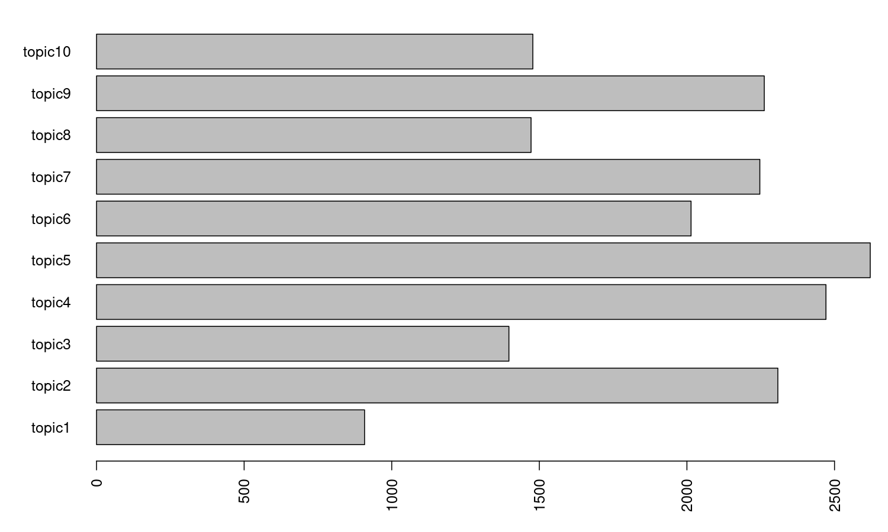
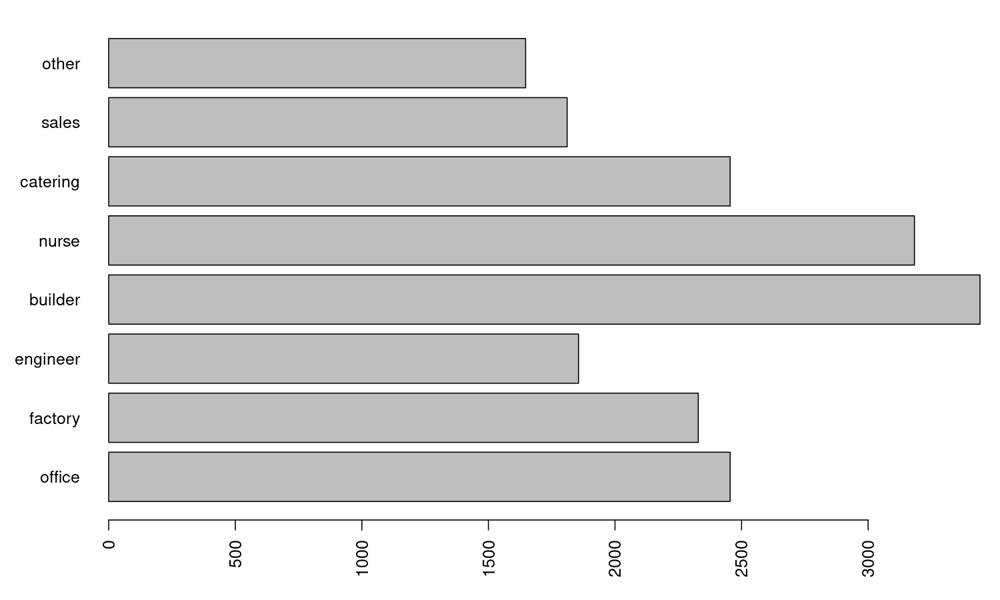

教師なしと準教師ありLDAの比較
================
Kohei Watanabe
2021-05-16

``` r
knitr::opts_chunk$set(echo = TRUE, dpi = 150, fig.height = 6, fig.width = 10, collapse = TRUE)
require(seededlda)
```

    ## Warning in .recacheSubclasses(def@className, def, env): undefined subclass
    ## "numericVector" of class "Mnumeric"; definition not updated

``` r
load("lda.RDA")
```

## 教師なしLDA

``` r
knitr::kable(as.data.frame(terms(lda, 30)))
```

| topic1   | topic2       | topic3         | topic4           | topic5   | topic6 | topic7   | topic8     | topic9   | topic10  |
|:---------|:-------------|:---------------|:-----------------|:---------|:-------|:---------|:-----------|:---------|:---------|
| 未経験者 | 管理         | 事業所         | 利用者           | 現場     | 営業   | 調理     | 更新       | 製造     | お客様   |
| 未経験   | 作成         | 利用           | 介護業務         | 工事     | 販売   | 清掃     | 商品       | 機械     | 未経験   |
| 安心     | パソコン     | ご覧           | 食事             | 鳥取県   | お客様 | 接客     | 雇用期間   | 使用     | 経験     |
| 経験者   | 事務         | ホームページ   | 送迎             | 施工管理 | 用車   | 配膳     | 正社員登用 | 製品     | 接客     |
| 清掃     | その他       | 業務全般       | 入浴             | 設計     | 社用   | 勤務     | 陳列       | 加工     | スタッフ |
| 丁寧     | 対応         | 勤務           | 高齢者           | 建設     | 提案   | 提供     | 安心して   | 安心して | 安心して |
| 充実     | 電話対応     | 令和           | 相談             | 中心     | 整備   | お客様   | 販売       | 丁寧     | 一緒     |
| 大歓迎   | 入力         | 場合           | 支援             | 行い     | 修理   | 料理     | 可能性     | 未経験   | 就業時間 |
| レジ     | 受付         | 病院           | 施設             | 土木工事 | 点検   | 盛り付け | 経験       | 工場     | 必要     |
| 従業員   | 電話         | 可能性         | 介助             | 公共工事 | 配達   | 調理補助 | 登用制度   | 行い     | 丁寧     |
| 優遇     | 使用         | 保育園         | 事業所           | 県東部   | 自動車 | 相談     | 心して応募 | 検査     | サポート |
| メイン   | 及び         | 保育           | 介護             | 管理業務 | 訪問   | 担当     | ヶ月       | 運搬     | 相談     |
| 万円     | 電話応対     | 保育業務       | 入浴介助         | 資格取得 | 使用   | 調理業務 | 業務全般   | 部品     | 働き     |
| 簡単     | 各種         | 看護業務       | 夜勤             | 施工     | 商品   | 簡単     | 研修       | 配送     | 店舗     |
| 時間     | 確認         | 採用           | 定員             | 資格     | 入社   | 食器洗浄 | 大丈夫     | 未経験者 | 研修     |
| 研修     | データ入力   | 販売           | デイサービス     | 工事現場 | 当社   | 洗浄     | 契約       | 組立     | 職場     |
| 相談     | 開発         | 所情報         | 食事介助         | 管理     | 行い   | 片付け   | 丁寧       | 主に     | 清掃等   |
| 店内     | システム     | 所ホームページ | 排泄             | 用車     | エリア | 勤務可能 | 調理       | 出荷     | 研修制度 |
| 可能     | 一般事務     | 詳しい事業     | 老人ホーム       | 使用     | 中心   | 準備     | ヶ月毎     | 食品     | レジ     |
| 商品     | 補助         | 雇用期間       | 送迎業務         | 必要     | 車使用 | 接客業務 | 簡単       | 急募     | 勤務     |
| 売り場   | エクセル     | レジ業務       | レクリエーション | 道路     | 車両   | ホテル   | 制服貸与   | 必要     | 行い     |
| 商品陳列 | 管理業務     | 雇用開始       | 見守り           | 主に     | 企画   | 客室     | 担当       | 経験     | 可能     |
| 衛生士   | 処理         | 目指           | 看護業務         | 現場管理 | 米子   | 案内     | レジ業務   | トラック | 募集     |
| 駐車場   | パソコン入力 | 外来           | 利用             | 社用     | 管理   | 行い     | 接客       | 教え     | 時間     |
| 歯科衛生 | 設計         | 接客           | 老人保健         | 建築     | 及び   | 厨房     | 回目       | 荷物     | 大歓迎   |
| 福利厚生 | ワード       | 習得           | 生活             | 補助     | 企業   | 食材     | レジ       | 体力     | 歓迎     |
| 者大     | 請求書       | 更新           | 行い             | 会社     | 急募   | 事前連絡 | 店舗       | 行う     | 中心     |
| 者優遇   | 手続き       | 安心して       | 有料老人         | 調査     | 車検   | ホール   | 契約期間   | 操作     | カット   |
| 士業務   | 来客対応     | 資格取得       | 入居者           | 行う     | 知識   | 食数     | 品出し     | 設備     | 入社     |
| スタッフ | 書類作成     | 病棟           | 保健施設         | 移動     | 案内   | 可能     | お客様     | 生産     | 以上     |

``` r
par(mar = c(4, 5, 1, 1))
freq <- table(topics(lda))
barplot(freq, horiz = TRUE, las = 2)
```

<!-- -->

## 準教師ありLDA

``` r
knitr::kable(as.data.frame(terms(slda, 30)))
```

| office       | factory    | engineer | builder  | nurse            | catering | sales    | other          |
|:-------------|:-----------|:---------|:---------|:-----------------|:---------|:---------|:---------------|
| パソコン     | 製造       | 設計     | 工事     | 介護             | 調理     | 接客     | 雇用期間       |
| 電話         | 加工       | 検査     | 建設     | 保育             | 配膳     | 営業     | 可能性         |
| 会計         | 組立       | 操作     | 施工     | 看護             | 清掃     | 販売     | 更新           |
| 経理         | 安心して   | 開発     | 塗装     | 利用者           | 勤務     | お客様   | ご覧           |
| メール       | 商品       | 管理     | 溶接     | 介護業務         | 就業時間 | 商品     | 利用           |
| 受付         | 丁寧       | 行い     | 現場     | 食事             | 提供     | レジ     | 事業所         |
| 事務         | 未経験     | 作成     | 用車     | 送迎             | 相談     | 店舗     | 場合           |
| 電話応対     | 陳列       | 設備     | 社用     | 相談             | 料理     | 未経験者 | 整備           |
| 入力         | 経験       | 企画     | 鳥取県   | 入浴             | 盛り付け | 経験     | ヶ月           |
| 管理         | 更新       | 及び     | 使用     | 支援             | お客様   | 安心して | ホームページ   |
| 対応         | 心して応募 | 調査     | 中心     | 高齢者           | 調理補助 | 未経験   | 行い           |
| 電話対応     | 正社員登用 | 管理業務 | 施工管理 | 施設             | 業務全般 | スタッフ | 令和           |
| その他       | 登用制度   | 企業     | エリア   | 事業所           | 洗浄     | 知識     | 自動車         |
| 作成         | 機械       | 提案     | 主に     | 看護業務         | 調理業務 | レジ業務 | 点検           |
| 確認         | 大丈夫     | 各種     | 土木工事 | 介助             | 担当     | 店内     | 修理           |
| 補助         | 製品       | システム | 県東部   | 定員             | 簡単     | 大歓迎   | 募集           |
| 使用         | 簡単       | 対応     | 車使用   | 入浴介助         | 食器洗浄 | 充実     | 勤務           |
| 業務全般     | 研修       | 使用     | 必要     | 夜勤             | 未経験   | 簡単     | 採用           |
| ワード       | 使用       | 道路     | 工事現場 | デイサービス     | 片付け   | 研修     | 経験           |
| データ入力   | 未経験者   | 点検     | 公共工事 | 食事介助         | 接客業務 | 補充     | 業務全般       |
| 一般事務     | 行い       | 測量     | 配達     | 勤務             | 歓迎     | 安心     | 所情報         |
| エクセル     | 販売       | 行う     | 配送     | 排泄             | 清掃業務 | 入社     | 所ホームページ |
| 病院         | 制服貸与   | 機器     | 資格取得 | 老人ホーム       | 勤務可能 | サポート | 車検           |
| パソコン入力 | 契約       | その他   | 資格     | 送迎業務         | 準備     | 目指     | 詳しい事業     |
| 及び         | ヶ月毎     | 当社     | 行い     | 保育園           | ホテル   | 提案     | 研修           |
| 患者         | 担当       | 実施     | 車両     | 利用             | 客室     | 必要     | 登用           |
| 処理         | 包装       | 顧客     | 会社     | レクリエーション | 未経験者 | 時間     | 正社員登用     |
| 相談         | 工場       | 必要     | 丁寧     | 見守り           | 大歓迎   | 清掃     | 相談           |
| 受付業務     | 業務全般   | 技術     | 運転     | 訪問             | 厨房     | 習得     | 入社           |
| 請求書       | 部品       | 河川     | 未経験者 | 生活             | 食材     | 従業員   | パーマ         |

``` r
par(mar = c(4, 5, 1, 1))
freq <- table(topics(slda))
barplot(freq, horiz = TRUE, las = 2)
```

<!-- -->
